# NG LMS — Hackathon Brief Documentation

**Project:** Progressive Student Dashboard (Full-Stack)  
**Product name:** NG LMS  
**Date:** 8 August 2026

Full documentation (same content): [README.md](./README.md)

---

## 1. Problem

Students and mentors lack a single place to track learning progress, time spent, course completion, and clear next steps. Progress is scattered; insights and oversight are weak.

## 2. Solution

**NG LMS** is a full-stack learning dashboard where:

- **Students** track lessons, time, trends, and get adaptive next steps
- **Mentors** monitor assigned students with course- and lesson-level completion details

---

## 3. Features Delivered

| Feature | Status |
|---------|--------|
| Email auth (student + mentor roles, JWT) | Done |
| Student dashboard (completed lessons, time spent, progress per course) | Done |
| Trend chart (time series) + donut (completion status) | Done |
| Course / lesson flow | Done |
| Timed study session + wrap-up question (auto time calculation) | Done |
| Activity events + aggregates APIs | Done |
| Adaptive recommendations (rule-based) | Done |
| CSV export | Done |
| Mentor dashboard + detailed course/lesson completion | Done |
| Seeded demo data + setup docs | Done |
| Swagger API documentation | Done |

---

## 4. Tech Stack

| Layer | Technology |
|-------|------------|
| Frontend | React.js (Vite) + TypeScript + Tailwind CSS + Recharts |
| Backend | Node.js + Express + TypeScript |
| ORM | Sequelize |
| Database | PostgreSQL |
| Auth | JWT + bcrypt |
| Validation | Zod |
| API docs | Swagger / OpenAPI (`/api/docs`) |

---

## 5. Architecture (brief)

```text
Student / Mentor
      │
      ▼
React (Vite) UI  ──REST + JWT──►  Express API
                                      │
                                      ▼
                                 PostgreSQL
                              (Sequelize ORM)
```

**Key design choices**

- PostgreSQL for relational progress data (users, enrollments, lessons, progress, events)
- Separate frontend/backend for a clear API surface and Swagger docs
- Rule-based recommendations (reliable demo; no external AI dependency)

---

## 6. How to Run

### Prerequisites
- Node.js 20+
- Local PostgreSQL

### Backend
```bash
cd backend
cp .env.example .env
# set DB_* credentials for your Postgres
npm install
npm run dev
```
- API: http://localhost:4000  
- Health: http://localhost:4000/api/health  
- Swagger: http://localhost:4000/api/docs  

### Frontend
```bash
cd frontend
cp .env.example .env
npm install
npm run dev
```
- App: http://localhost:5173  

With `DB_SYNC=true` and `DB_SEED=true`, schema + demo data load on API boot.

---

## 7. Demo Accounts

| Email | Password | Role |
|-------|----------|------|
| `student@demo.com` | `Demo@12345` | Student |
| `mentor@demo.com` | `Demo@12345` | Mentor |
| `rahul@demo.com` | `Demo@12345` | Student |

---

## 8. Screenshots

### Landing
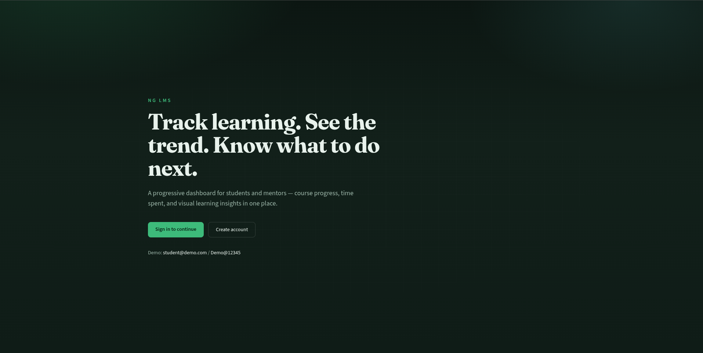

### Login
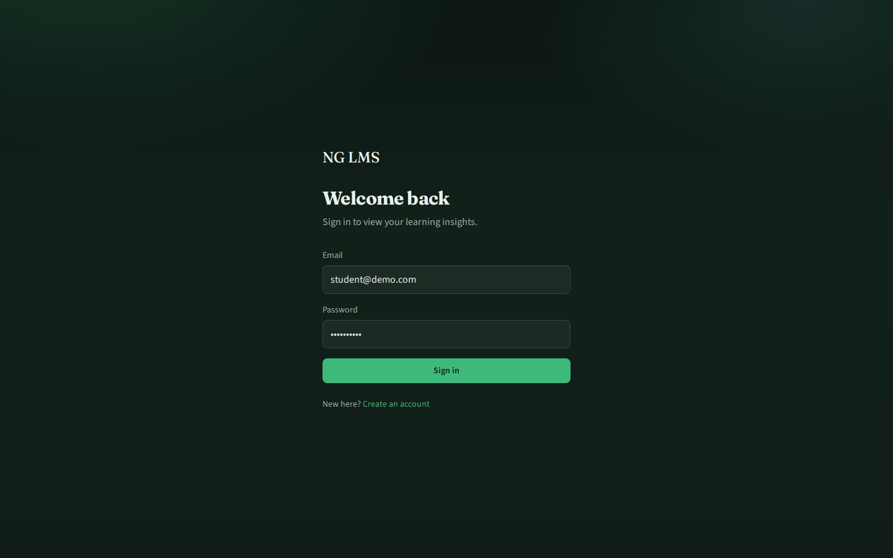

### Register
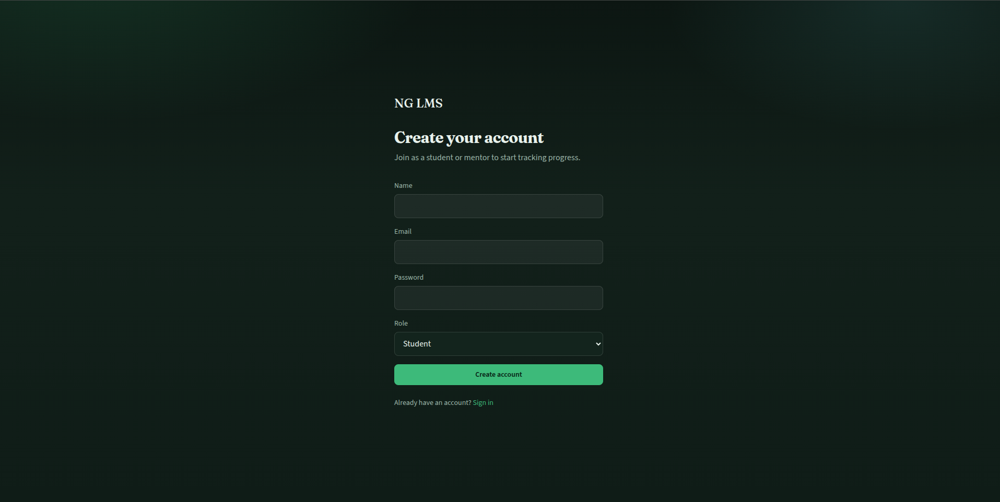

### Student dashboard
KPIs, next-step recommendations, trend chart, and completion mix.

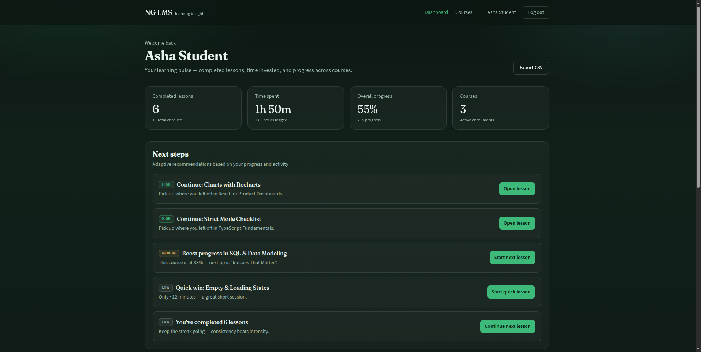

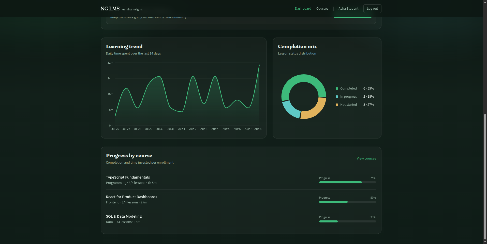

### Courses & course detail
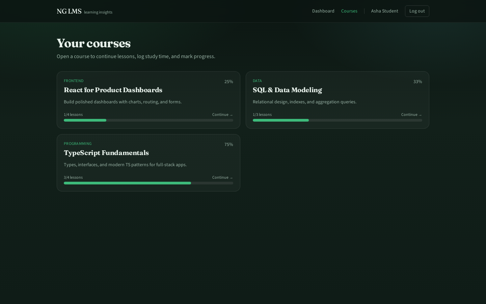

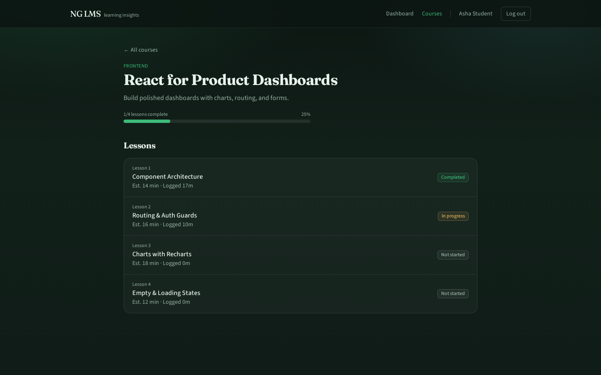

### Timed lesson session
Start → study with live timer → wrap-up question.

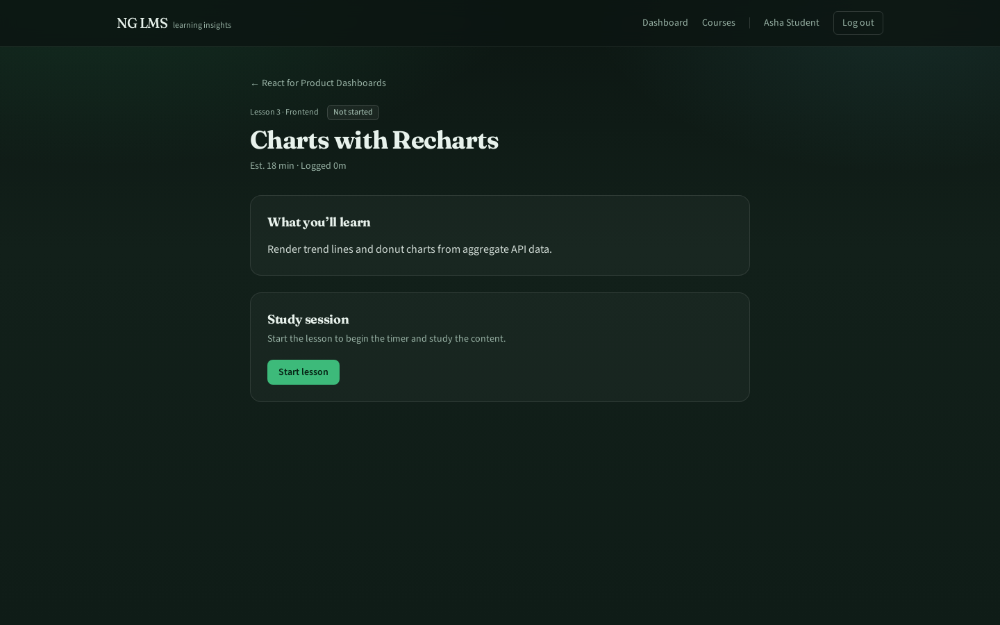

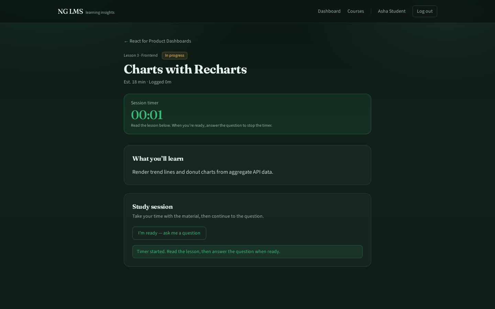

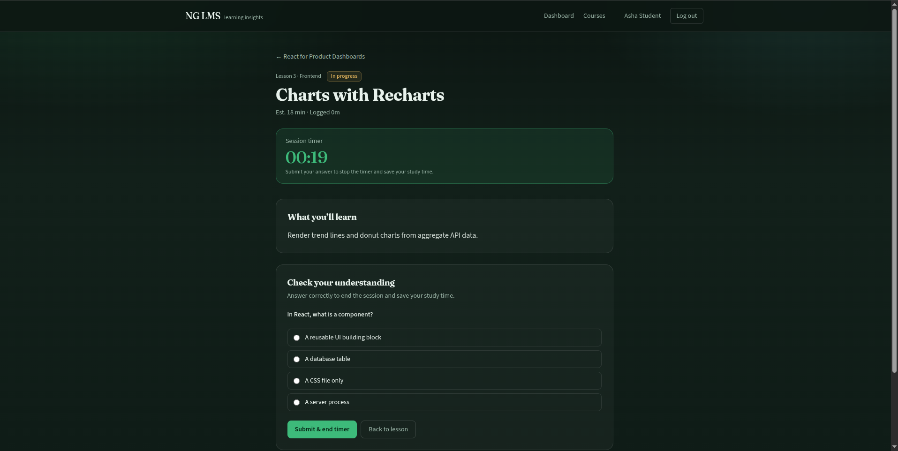

### CSV export
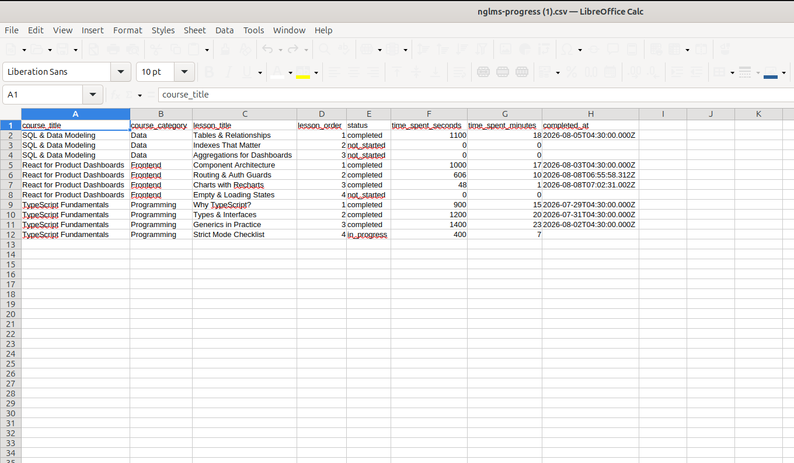

### Mentor views
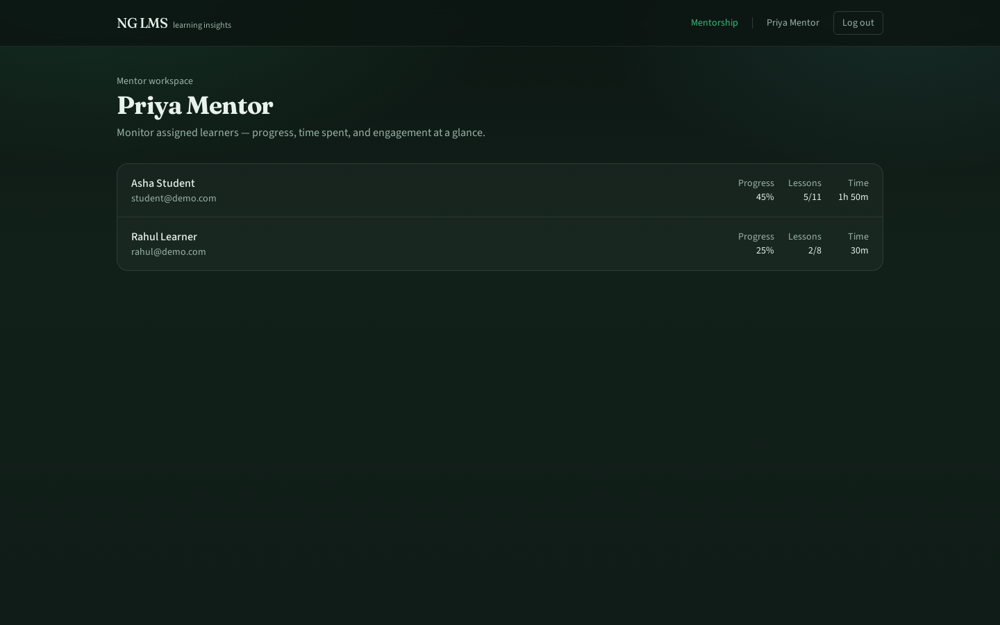

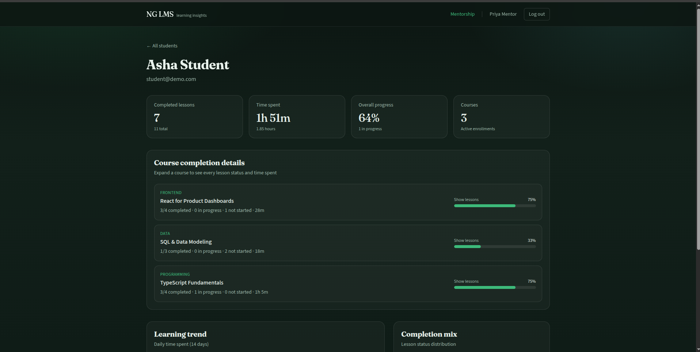

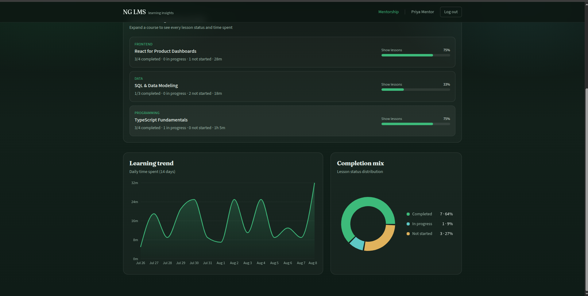

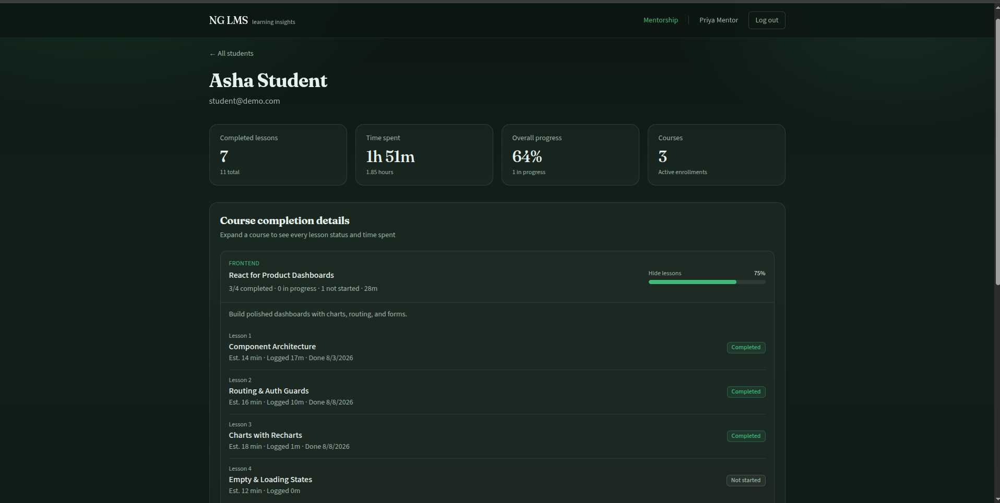

### Swagger API docs
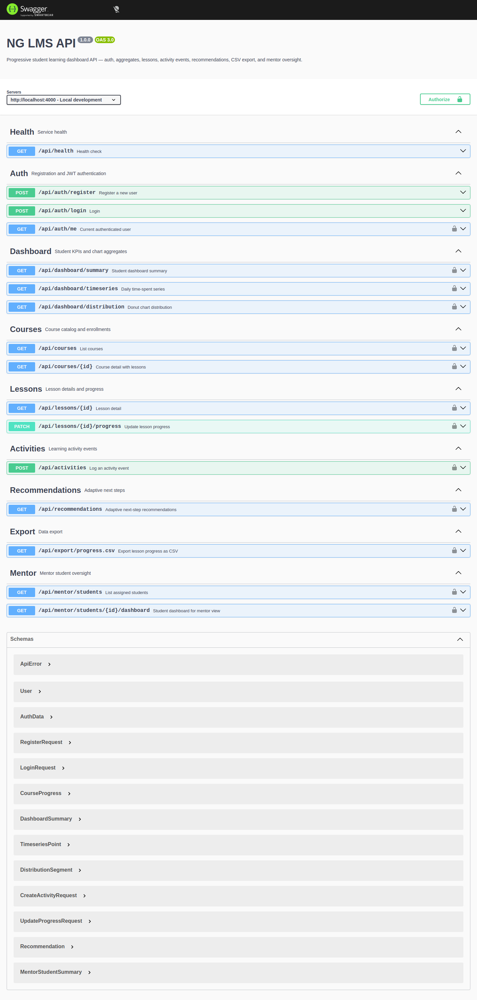

---

## 9. Reviewer Walkthrough (2–3 min)

1. Login as **student@demo.com** / **Demo@12345**
2. Open **Dashboard** — KPIs, recommendations, trend + donut charts
3. Open a **Course → Lesson**
4. Click **Start lesson** (timer starts) → read content → answer question → **Submit** (timer ends, time saved)
5. Logout → login as **mentor@demo.com** / **Demo@12345**
6. Open a student → expand **Course completion details** (lesson-level status)

---

## 10. Main APIs

| Method | Endpoint | Role |
|--------|----------|------|
| POST | `/api/auth/register`, `/api/auth/login` | Public |
| GET | `/api/auth/me` | Authenticated |
| GET | `/api/dashboard/summary`, `/timeseries`, `/distribution` | Student |
| GET | `/api/courses`, `/api/courses/:id` | Authenticated |
| GET/PATCH | `/api/lessons/:id`, `/api/lessons/:id/progress` | Student (progress) |
| POST | `/api/activities` | Student |
| GET | `/api/recommendations` | Student |
| GET | `/api/export/progress.csv` | Student |
| GET | `/api/mentor/students`, `/api/mentor/students/:id/dashboard` | Mentor |

Full interactive docs: **http://localhost:4000/api/docs**

---

## 11. Project Structure

```text
ng-hackathon/
├── backend/            Express + Sequelize API + Swagger
├── frontend/           React (Vite) student & mentor UI
├── docs/screenshots/   UI screenshots for submission
├── README.md           Full documentation
└── HACKATHON.md        This brief
```

---

## 12. Notes for Evaluators

- Seeded data is ready for immediate demo (no manual course creation needed)
- Study time is measured by a live session timer and saved when the wrap-up question is submitted
- Mentor view includes per-course and per-lesson completion, not only summary percentages
- Security basics: password hashing, JWT roles, input validation, Helmet, CORS, rate limiting
